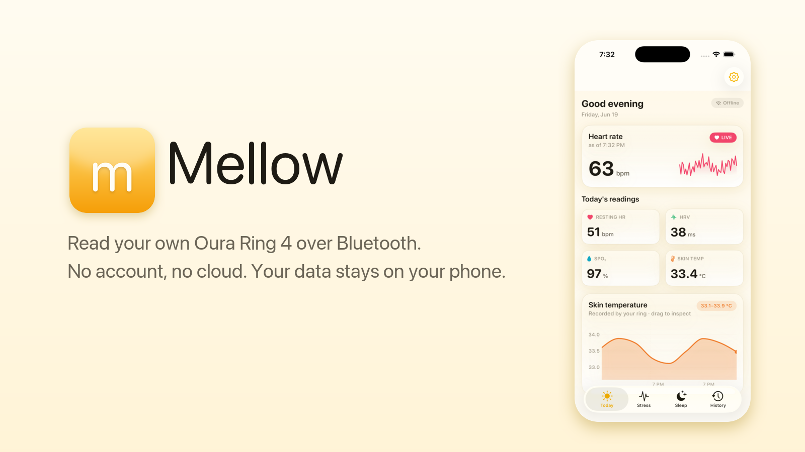

<p align="center">
  
</p>

# Mellow

Read your own Oura Ring 4 over Bluetooth, on your own phone, with no account and no subscription. The data never leaves your device.

Mellow talks to the ring directly over Bluetooth LE, decodes the readings on-device, and shows them to you. There is no server. The protocol work is written from watching my own ring's Bluetooth traffic on my own hardware.

## Status

Early build for tinkerers, not a replacement for the official app.

**Working:** heart rate (in measurement bursts) and skin temperature, decoded on-device. SpO₂ comes out of the raw red/IR PPG by ratio-of-ratios (SpO₂ = 110 − 12·R, resting night ~95%). The morning sync backfills the night the ring recorded to its own flash while you slept.

**Built, waiting on data:** recovery, sleep, strain, trends, history, a widget, Apple Health export. The screens are wired to the metrics engine, but a recovery or sleep score needs several nights of baseline first. Until then the app shows what the ring reports and hides the scores rather than printing a made-up number.

**Unverified:** live streaming has only run against my ring. A firmware update can change the protocol and break decoding.

## Connecting

Every time the ring touches the official Oura app, it locks to that account and rejects your key. The handshake returns status `0x03` ("not the original onboarded device"). That's not a bug in Mellow, and retrying won't fix it.

The fix: factory-reset the ring in the Oura app, put it on the charger, and claim it again. The Connect screen walks you through it (reset, forget the stale pairing in iOS Bluetooth settings, charger, claim).

## How it's built

A Rust core (`oura_core`) handles the wire protocol: framing, the AES-128 handshake, the per-record decoders. The same core runs on the phone, on the Mac, and under its own tests. The SwiftUI app (`Mellow`) owns Bluetooth, the screens, and the optional Health write-through. Swift talks to Rust through a thin C bridge with JSON messages.

Setup is once, with your own key. Mellow uses the ring's own key-set step to install a 16-byte key you control on a ring you own. It doesn't crack or bypass anything; Oura's encryption stays intact.

## Build and install

You need a Mac with Xcode 16+, [XcodeGen](https://github.com/yonyz/XcodeGen) (`brew install xcodegen`), Rust ([rustup.rs](https://rustup.rs)), a physical iPhone with an Oura Ring 4 (Bluetooth does nothing in the Simulator), and an Apple ID added to Xcode for signing. A free Apple ID works; free-account apps just expire after 7 days and need a rebuild.

Plug your iPhone into the Mac, unlock it, and run:

```sh
./install.sh
```

It generates the project, builds the Rust core and the app signed with your Apple ID, and installs Mellow onto the phone. First run, set your team once in Xcode under the Mellow target, Signing & Capabilities.

Or drive Xcode yourself:

```sh
cd Mellow
xcodegen generate
open Mellow.xcodeproj
```

There's no prebuilt download. iOS won't run an app that isn't signed for your own Apple ID and device, so everyone builds their own copy.

## Legal

Mellow is interoperability software under 17 U.S.C. § 1201(f): an independently created program that lets hardware you own exchange data with software of your choosing, so you can read your own measurements off your own body.

It's clean-room. The code is written from observed device behavior, with no Oura source, decompiled binaries, firmware, or captured proprietary data in this repository. No keys or captures are distributed. The 16-byte key is generated and controlled by you.

Not affiliated with, authorized, endorsed by, or sponsored by Ōura Health Oy. "Oura" and "Oura Ring" are trademarks of their owner, used here only to describe the hardware Mellow talks to.

Everything runs on your device. Mellow has no servers, collects nothing, and ships no analytics or telemetry. Using it can break Oura's app terms of service, a private contract matter separate from copyright. Use it with a ring you own, for your own data.

Hobby project, as-is, no warranty.

## License

GPL-3.0. See [LICENSE](LICENSE). Build on it and redistribute, just keep it GPL-3.0.
